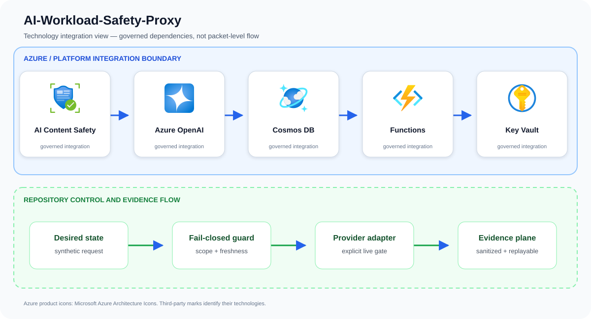
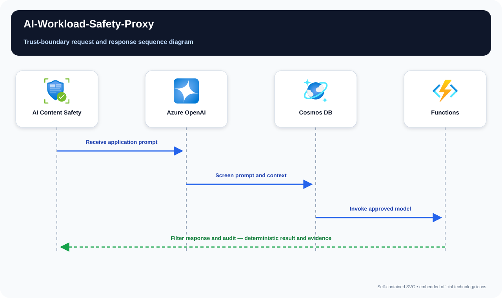

# AI-Workload-Safety-Proxy

Mediate enterprise LLM traffic to reduce prompt injection, unsafe content, and sensitive-data leakage.

## Project metadata

The metadata below is derived from tracked source, manifests, and infrastructure
files. It describes what this repository includes; live-service integration remains
bounded by the documented deployment and validation limitations.

| Category | Included |
| --- | --- |
| Platforms | Microsoft Azure; GitHub Actions |
| Services and stack | AI Content Safety; Azure OpenAI; Cosmos DB; Functions; Key Vault |
| Languages and formats | Python; Bicep; Bicep parameters; Bash; JSON; YAML |
| Delivery and IaC | Bicep + `.bicepparam`; GitHub Actions CI; YAML configuration; Python validation/tests |

## Problem statement

A synthetic LLM request passes through tenant validation, prompt-injection and sensitive-data policy checks, bounded content decisions, and redacted audit planning before any model adapter is called.

A production implementation can still fail even when every resource deploys successfully. The material risk is untrusted content, model routing, or tool execution crossing an identity or data boundary even though the model call succeeds. The design therefore treats AI Content Safety, Azure OpenAI, Cosmos DB, and the surrounding identity and evidence controls as one reviewable system rather than unrelated configuration tasks.

## Example case study

### Situation

A customer-service copilot accepts untrusted text from users and retrieved documents. The proxy creates a controllable boundary for prompt injection, harmful content, and PII leakage instead of trusting every application team to implement filters correctly.

### Response

A retailer replays benign support questions alongside prompts containing hidden instructions and customer identifiers. The proxy blocks or redacts unsafe requests, forwards only policy-compliant content, and records decision metadata without retaining conversation bodies.

The team first exercises the repository's synthetic approved and denied fixtures. An approved request must produce the same idempotent plan on replay; a stale, unscoped, public, or unapproved request must fail before an Azure adapter is allowed to run.

### Expected outcome

Stakeholders receive a decision package they can attach to a change record: requested scope, controls evaluated, the reason for approval or denial, and the explicit handoff to live integration. The example supports design review and incident rehearsal without pretending that a local test changed Azure.

## Architecture

A Functions or containerized proxy authenticates callers, normalizes input, invokes Content Safety plus configurable PII and injection detectors, applies policy decisions, calls Azure OpenAI privately, checks output, and stores only redacted audit metadata.

Primary services: `AI Content Safety`, `Azure OpenAI`, `Cosmos DB`, `Functions`, `Key Vault`.

This repository implements the first production-oriented vertical slice: a
fail-closed, adapter-neutral control plane that validates tenant scope,
freshness, approvals, secretless identity, private access, and the exact
project action before producing a deterministic execution plan. Azure adapters
consume that plan; they are deliberately outside the local simulator so local
tests cannot claim a live cloud change occurred.



The upper boundary names the principal services and technologies used by this repository. The lower boundary shows the implemented control flow: desired state is validated, provider action remains an explicit integration gate, and sanitized evidence is retained for review and deterministic replay.

## Best complementary diagram

**Recommended view: Trust-boundary request and response sequence diagram.** A sequence view is the strongest complement because it exposes runtime order, trust hand-offs, fail-closed decisions, and the evidence returned to the caller.



The view follows **Receive application prompt → Screen prompt and context → Invoke approved model → Filter response and audit**. Use it during design reviews, operational walkthroughs, and failure-mode discussions; use the logical architecture above when the question is which technologies integrate.

## Quickstart

Requirements: Python 3.11+ and Git. No Azure credentials are required.

```bash
./scripts/validate.sh
python3 src/control_plane.py --request examples/approved-request.json
```

The command emits canonical JSON with a stable idempotency key. The denied
fixture exits with status 2 and explains the failed invariants.

## Security boundaries

- Managed identity or workload identity only; embedded credentials are denied.
- Public network access and stale evidence are denied.
- Production and break-glass targets require explicit approval.
- The IaC entry point is opt-in and defaults to deploying nothing.
- Evidence output contains identifiers and decisions, never credential values.

## Verification and limitations

Local validation covers 13 tests, deterministic replay, JSON parsing, Python
compilation, ignore hygiene, and Bicep compilation when a compiler is present.
It does **not** prove Azure deployment, service licensing, quota, data-plane
permissions, provider/API availability, cloud failover, load, cost, or teardown.
See [`docs/test-matrix.md`](docs/test-matrix.md) and [`docs/runbook.md`](docs/runbook.md) before any integration trial.

## Community

See [`CONTRIBUTING.md`](CONTRIBUTING.md), [`SECURITY.md`](SECURITY.md), [`SUPPORT.md`](SUPPORT.md), and [`LICENSE`](LICENSE). The reference
is intentionally conservative and uses synthetic identifiers only.

## Repository guide

- [Architecture](docs/architecture.md)
- [Threat model](docs/threat-model.md)
- [Operations runbook](docs/runbook.md)
- [Test matrix](docs/test-matrix.md)
- [Cost model](docs/cost-model.md)
- [Security policy](SECURITY.md)
- [Contributing guide](CONTRIBUTING.md)
- [Support policy](SUPPORT.md)
- [Changelog](CHANGELOG.md)
- [License](LICENSE)

## Infrastructure inputs

Resource behavior and deploy-time values are intentionally separated:

- [Bicep template](infra/main.bicep) — Azure resources, modules, and security controls.
- [Bicep parameters](infra/main.bicepparam) — environment-specific names, regions, identities, and feature inputs.

Start with the parameter file's safe values, replace synthetic identifiers, and run an Azure what-if before deployment.

## Attribution

Azure product icons come from [Microsoft's official Azure Architecture Icons](https://learn.microsoft.com/azure/architecture/icons/). Open-source marks are sourced from [Simple Icons](https://simpleicons.org/) when shown; each mark identifies its respective technology.
